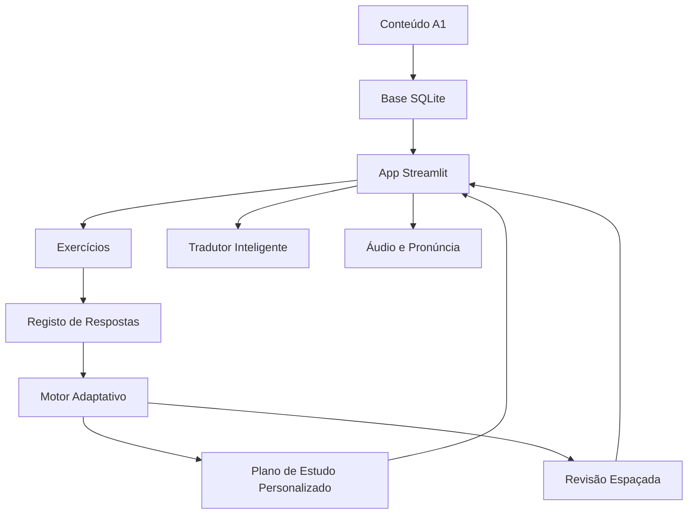

# Deutsch A1 PT Learning Coach

Aplicação Python + Streamlit para aprender alemão A1 a partir do zero, com explicações em português europeu.

Esta app não é apenas um tradutor. Funciona como um treinador de aprendizagem: ensina, gera exercícios, corrige respostas, guarda erros, detecta pontos fracos, recomenda o próximo estudo e usa revisão espaçada.

## Objectivo

Ajudar uma pessoa portuguesa, sem conhecimentos prévios de alemão, a construir bases A1 em:

- vocabulário
- gramática
- leitura
- audição
- fala
- escrita
- tradução contextual
- revisão espaçada

## Para Quem É

Para iniciantes absolutos que querem aprender alemão de forma guiada, com explicações simples em português.

## Funcionalidades

- Caminho A1 por módulos
- Vocabulário com artigos `der`, `die`, `das`
- Flashcards e exemplos
- Gramática explicada em português
- Exercícios dinâmicos
- Correcção imediata
- Classificação de erros
- Mastery score por tópico
- Motor adaptativo
- Revisão espaçada SM-2 simplificada
- Tradutor inteligente offline A1
- Áudio com gTTS quando disponível
- Treino de escrita e fala com fallback local
- Diagnóstico e dashboard de progresso

## Roadmap A1

1. Primeiros passos: alfabeto, pronúncia, cumprimentos, apresentação.
2. Eu e os outros: nome, idade, origem, residência, nacionalidades.
3. Frases simples: pronomes, `sein`, `haben`, ordem da frase.
4. Família e trabalho: família, profissões, possessivos.
5. Comida, compras e preços: comida, números, restaurante.
6. Cidade e transporte: lugares, direções, transportes.
7. Rotina diária: horas, verbos comuns, verbos separáveis.
8. Revisão A1: leitura, audição, escrita e fala.

## Arquitectura



## Base de Dados

A app usa SQLite em:

```text
data/deutsch_a1.db
```

Tabelas principais:

- `user_profile`
- `lessons`
- `vocabulary`
- `grammar_topics`
- `exercises`
- `user_attempts`
- `mastery_state`
- `review_queue`
- `translation_history`
- `speaking_attempts`
- `writing_attempts`

## Instalação

```bash
cd Deutsch_A1_PT_Learning_Coach
python3 -m venv .venv
source .venv/bin/activate
pip install -r requirements.txt
```

## Como Executar

```bash
streamlit run app.py
```

Na primeira execução, a app cria a base SQLite e carrega os ficheiros seed.

## Tutorial HTML

Existe um guia completo de setup e utilização em:

```text
docs/tutorial_setup_utilizacao.html
```

Inclui instalação, primeira execução, explicação das páginas, rotina de estudo, revisão espaçada, reset de progresso, testes e problemas comuns.

## Como Reiniciar Progresso

Apaga a base local:

```bash
rm data/deutsch_a1.db
```

Depois executa novamente:

```bash
streamlit run app.py
```

## Como Adicionar Vocabulário

Edita:

```text
data/seed_vocabulary_a1.csv
```

Campos importantes:

- `german`
- `portuguese`
- `article`
- `plural`
- `word_type`
- `topic`
- `example_de`
- `example_pt`
- `difficulty`

## Como Adicionar Exercícios

Edita:

```text
data/seed_exercises_a1.csv
```

Tipos suportados:

- `multiple_choice`
- `fill_blank`
- `translation_de_pt`
- `translation_pt_de`
- `article_choice`
- `verb_conjugation`
- `order_words`

## Motor Adaptativo

O motor usa:

- resultados recentes
- tipos de erro
- mastery score
- tópicos fracos
- revisões em atraso
- dificuldade

Regras:

- abaixo de 50%: baixa dificuldade
- acima de 80%: pode aumentar dificuldade
- 70% do treino foca pontos fracos
- 30% introduz novo conteúdo

## Revisão Espaçada

A revisão usa uma versão simplificada do algoritmo SM-2:

- `Não sabia`: volta amanhã
- `Difícil`: intervalo curto
- `Médio`: intervalo médio
- `Fácil`: intervalo maior

## Limitações

- O tradutor offline é aproximado e limitado ao conteúdo A1 local.
- A geração de áudio com gTTS pode precisar de internet.
- A fala usa fallback por texto quando não há reconhecimento de voz.
- As correcções de escrita são baseadas em regras simples se não houver LLM.

## Melhorias Futuras

- Conteúdo A2
- Reconhecimento de voz mais robusto
- Integração opcional com LLM
- Mais exercícios de audição
- Estatísticas por sessão
- Perfis múltiplos de utilizador

## Testes

```bash
pytest
```

Os testes cobrem vocabulário, gramática, revisão espaçada, correcção de exercícios, motor adaptativo, tradução fallback e criação da base.
